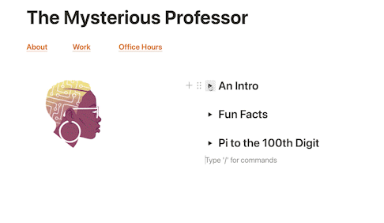

# JavaScript for your profile page

## Introduction

In this project, you'll be adding JavaScript to your profile page to make it interactive. You're going to implement a toggle, so that when a visitor clicks on one of your headings, the paragraph text is displayed.

This is an example

## Instructions

**Before you get started**

Have a read of this [document](https://developer.mozilla.org/en-US/docs/Web/API/Element/classList), note how `toggle` is used in the example code being called on the `classList` method.

Prepare what you'll need to build the site. Write down all of the facts and info you'll put on the website. You can use the file `site-plan.md` to take notes, or write things somewhere else.

Copy and paste the HTML and styles from your profile page project. You'll be adding the interactivity on top of that.

You'll be editing both the `index.html` and `main.js` files, so make sure you're adding the correct code in the correct files.

## Steps

### HTML

1. Add an ID to each of your headings except the title of the page. Make sure the IDs are unique.
2. Add an ID to the corresponding paragraphs.

### CSS
3. Change the display of the paragraphs so that they're hidden on the page.
4. Create a class called `.show` or `.visible` that sets the `display` to `block` (or what the paragraph elements were before).

### JS
5. Create variables that store your heading elements.
6. Create variables that store your paragraph elements.
You should have as many heading variables as you do headings in the HTML, and you should have as many paragraph variables as you do paragraph elements in the HTML.
7. Add a click event listener to each heading variable.
8. Within the event listener, get the corresponding paragraph for the heading and call toggle on its classList. (If you get stuck remember to revisit the [MDN document](https://developer.mozilla.org/en-US/docs/Web/API/Element/classList))
9. Open your index.html file in your browser and test that it works

## Rubric

Use this checklist to confirm that you've included everything you need:

- [ ] You should have an equal number of heading variables as heading elements
- [ ] You should have an equal number of paragraph variables as paragraph elements
- [ ] You should have a click event listener on each heading variable
- [ ] You should have a toggle on the classList of each paragraph variable
- [ ] You should have a `.show` or `.visible` class
- [ ] Your paragraph elements should be hidden from the page by default.
- [ ] Still has the Disclaimer at the top of the page

## Bonus
